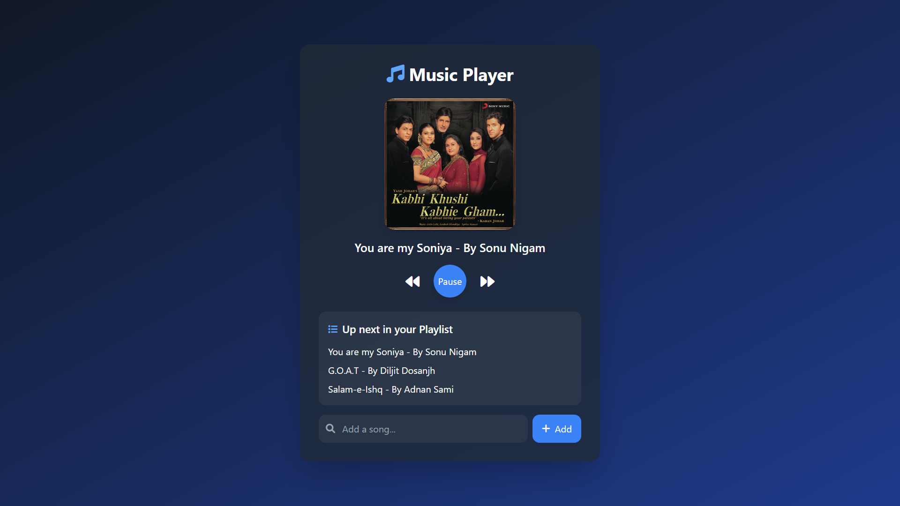

This is Course Project of Cambridge 3rd Semester DSA Course - 23CS204

# Music Player

A simple music player website built using JavaScript, utilizing the various concepts of **Data Structures** 

## Features:
- Create a custom playlist of songs with the ability to add songs dynamically.
- View the playlist with real-time updates as songs are added or played.
- Play and pause functionality for songs.
- Display the cover image of the currently playing song.
- Play the next song in the playlist queue automatically or manually.
  
## Data Structures Used:
- **Queue** for managing the playlist, ensuring songs are played in the order they are added (FIFO: First In, First Out).

## User Interface

